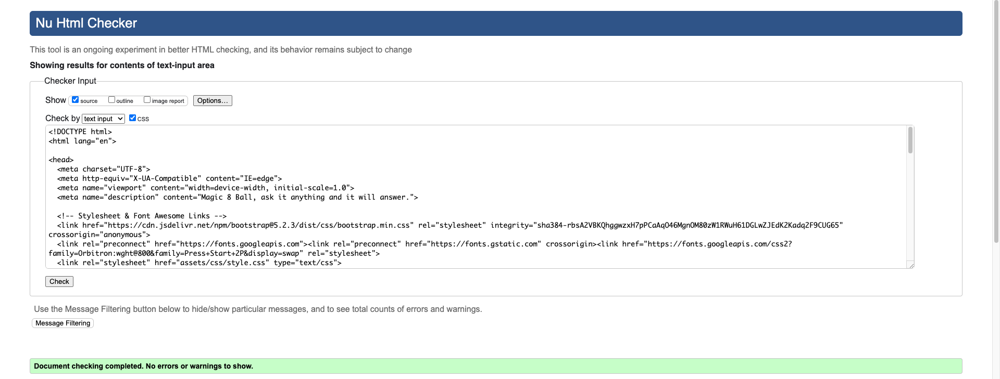
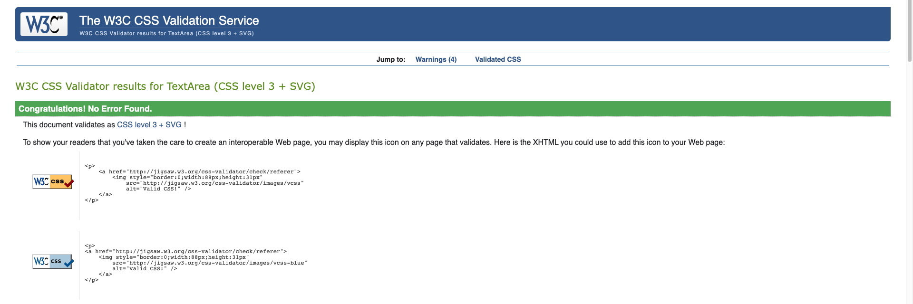
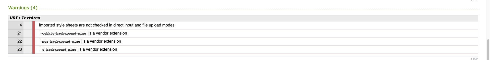

# The Magic 8 Ball

The Magic 8 Ball is used for fortune telling or seeking advice. This is a fun website where users can ask a question and receive a response that affirms or rejects their query; it can also provide a neutral response.

The primary technologies used to form the basis of this website are the coding languages HTML, CSS and JavaScript which were complemented by use of the Bootstrap framework.

[View the live site here](https://davecoll3.github.io/magic-8-ball/)

&nbsp;


&nbsp;

# Table of Contents
  * [UX and UI](#ux-and-ui)
    * [Research](#research)
    * [Owner Goals](#owner-goals)
    * [User Stories](#user-stories)
    * [User Requirements and Expectations](#user-requirements-and-expectations)
    * [Design](#design)
    * [Wireframes](#wireframes)
  * [Features](#features)
    * [Existing Features](#existing-features)
    * [Features to be Implemented in the Future](#features-to-be-implemented-in-future)
  * [Technologies Used](#technologies-used)
    * [Languages](#languages)
    * [Frameworks and Libraries](#frameworks-and-libraries)
    * [Testing and Validation Tools](#testing-and-validation-tools)
  * [Testing](#testing)
  * [Validation](#validation)
    * [HTML](#html)
    * [CSS](#css)
    * [Color Contrast](#color-contrast)
  * [Deployment](#deployment)
    * [Forking the GitHub Repository](#forking-the-github-repository)
    * [Making a Local Clone](#making-a-local-clone)
  * [Credits](#credits)

&nbsp;

# UX and UI

## Research

Research for the creation of this site was carried out by searching for various forms and variations on the 

* [Origami Fortune Teller](https://www.horoscope.com/us/games/divination/game-origami-fortune-teller.aspx)
* [Ask the Crystal Ball](https://www.crystalballfree.com/)
* [Magic 8 Ball](https://legomenon.com/ask-magic-8-ball-game-online.html)
* [Fortune Cookie](https://fortune-telling-online.com/readings/free-oracles-and-games/fortune-cookie/)
* [Cuppy Fortune Teller](https://www.buzzfeed.com/morgansloss1/this-interactive-fortune-telling-quiz-will-predict-your)

&nbsp;

## Owner Goals

  * Create a short but fun advice/fortune telling game.
  * To generate interest in their games.
  * Potentially generate enough traffic to attract advertisers.

&nbsp;

## User Stories

### First Time Visitor

  * As a first time user, I want to understand the main purpose of the site.
  * As a first time user, I want to easily understand how the game works.
  * As a first time user, I want feedback if I am doing something wrong.

### Returning Visitor

  * As a returning user, I want to be easily able to replay the game.
  * As a returning user, I want to be able to quickly identify who produced the website/game.

&nbsp;

## User Requirements and Expectations

### Requirements

  * Familiar and intuitive design that negates any learning curve.
  * A reactive site that is user friendly and well presented on all types of device and screen sizes.
  * An easy and logical means of playing the game.
  * Adequate levels of color contrast across the site that presents content in an accessible and easy to read manner.
  * Appealing graphics and animations that enhance the user experience.

### Expectations

  * Feedback when interacting with the game that is also instructive. 
  * Clicking on the "Shake!" button should result in a shake effect on the Magic 8 Ball.
  * A response should be displayed once a question has been submitted.

&nbsp;

## Design

### Imagery
* An image of the Orion Nebula was used to create a visual link to mysticism that is intrinsically conected to space and space iconography. It has a vibrant, colourful aesthetic that is visually appealing. 

### Color Scheme

* Black and white colours were used on the Eight Ball as is traditional. White, black and grey text was used across the site to provide good contrast; adhering to the WCAG 2.1 contrast guidelines. Magenta, cyan, and white was used to help blend the Eight Ball into the background image. In keeping with this theme, various shades of purple were used on the "Shake!" button and on the back area of the Eight Ball itself to provide some shading and make it seem less two dimensional.

### Fonts

* The Google font of Nunito was chosen as it is a well balanced typeface with a slightly rounded edge which fits in with the overall look of the site, providing good definition without detracting form the imagary.

### Structure

* This is a single-product website that does not require any navigation links. In the future, this site could be incorporated into a multi-page website containing additional games or content.

&nbsp;

## Wireframes

* Balsamiq Wireframes was used to create the wireframes for this site. 
Wireframes for mobile, tablet, and desktop can be found below:

  ### [Mobile Wireframe](/readme-files/wireframes/mobile-wireframes.pdf)

  ### [Tablet Wireframe](/readme-files/wireframes/tablet-wireframes.pdf)

  ### [Desktop Wireframe](/readme-files/wireframes/desktop-wireframes.pdf)

&nbsp;

[Back to top &uarr;](#the-magic-8-ball)

# Features 

## Existing Features

* Header

  * The header containes a h1 element, with the name of the game, which is followed by a line of text that provides a simple and concise instruction on how it works.

    

* 8 Ball

  * The Eight Ball itself is in traditional black and white colors with shades of magenta, cyan, and white was used to help blend it into the background image. Some purple shading was added to the back area of the Eight Ball to provide some shading and make it seem less two dimensional.

    

* 8 Ball Animation

  * Once a valid question has been submitted by the user, a short 1 second animation is triggered which shakes the Eight Ball from side to side; as was traditionally done with the physical Eight Ball toy in order to obtain an answer to the users question.

    

* User input

  * The user input section consists of a text input and a button. The text input contains placehoder text which propts the user to enter their question while the botton is used to submit their question; a enter key press can also be used to submit a question.

    

* Error Message

  * Should a user fail to write a question, an error message is displayed underneath the button which prompts them to ask a question.

    

* Footer

  * The footer consists of copyright information for the site and game.

    


## Features to be Implemented in Future

  * ????????
  * ????????
  * ????????
  * ????????
  * ????????

&nbsp;

[Back to top &uarr;](#the-magic-8-ball)

# Technologies Used

## Languages
  * [HTML](https://en.wikipedia.org/wiki/HTML)
  * [CSS](https://en.wikipedia.org/wiki/CSS)
  * [JavaScript](https://en.wikipedia.org/wiki/JavaScript)

## Frameworks and Libraries

  * [Bootstrap](https://getbootstrap.com/docs/5.2/getting-started/introduction/)
    * Bootstrap v5.2.3 was used to form the user input section of the site, namely to provide the text input and button elements.
  * [Google Fonts](https://fonts.google.com/)
    * Google Fonts was used to import the 'Barlow' font used throughout the site.

## Testing and Validation Tools
  * [Chrome DevTools](https://developer.chrome.com/docs/devtools/)
    * Google Chrome DevTools was used to carry out manual testing on the website and to simulate mobile devices.
  * [W3C Markup Validation Service](https://validator.w3.org/#validate_by_input)
    * The W3C Markup Validation Service was used to check the markup validity of the html code. 
  * [W3C CSS Validation Service](https://jigsaw.w3.org/css-validator/#validate_by_uri)
    * The W3C CSS Validation Service was used to validate the css code.
  * [JSHint](https://jshint.com/)
    * The JSHint static code analysis tool was used to check if the JavaScript source code complies with coding rules. 
  * [Lighthouse](https://developer.chrome.com/docs/lighthouse/overview/)
    * Lighthouse was used to audit performance, accessibility, best practices and SEO across the website.
  * [a11y](https://color.a11y.com/)
    * The a11y Color Contrast Accessibility Validator was used to verify that the colour contrast across the site adhered to the WCAG 2.1 Guidelines.
  * [LambdaTest](https://www.lambdatest.com/)
    * LambdaTest was used to perform cross browser testing.

&nbsp;

[Back to top &uarr;](#the-magic-8-ball)

# Testing 

Testing information can be found in the [testing file][TESTING.md].

&nbsp;

[Back to top &uarr;](#the-magic-8-ball)

# Validation

## HTML
The [W3C Markup Validation Service](https://validator.w3.org/#validate_by_input) was used to validate the code.
The site was successfully validated with no errors or warnings.

<details><summary>HTML Validation</summary>

</details>

&nbsp;

## CSS
The [W3C CSS Validation Service](https://jigsaw.w3.org/css-validator/#validate_by_uri) was used to validate the code.
No errors were found but four warnings were highlighted; as these related to the imported google fonts stylesheet and prefixes relating to different browsers, they are not of concern.

<details><summary>CSS Validation</summary>

</details>

<details><summary>CSS Warnings</summary>

</details>

&nbsp;

## Color Contrast
The color contrast accessibility validator [a11y](https://color.a11y.com/) was used to verify that the colour contrast across the site adhered to the [WCAG 2.1 Guidelines](https://www.w3.org/TR/WCAG21/).

<details>
<summary>Homepage</summary>


</details>

<details>
<summary>My Work Page</summary>


</details>

<details>
<summary>Gallery Page</summary>


</details>

<details>
<summary>Contact Me Page</summary>


</details>

&nbsp;

[Back to top &uarr;](#the-magic-8-ball)

# Deployment

The site was deployed to GitHub pages. The steps to deploy are as follows:
  1. Log in to GitHub and locate the repository: [magic-8-ball](https://github.com/davecoll3/magic-8-ball).
  2. Once in the repository, navigate to the Settings tab at the top of the page.
  3. On the settings page, locate the Pages option on the left hand menu.
  4. Under the Build and deployment heading, navigate to the "Deploy from a branch" dropdown menu under the subheading Source; select master.
  5. Save your changes.
  6. After a few minutes, return to/refresh this page and a link will now be supplied at the top of the Pages section. 

The live link can be found [here](https://davecoll3.github.io/magic-8-ball/)

&nbsp;

## Forking the GitHub Repository

Forking the GitHub Repository makes a copy of the original repository on our GitHub account; allowing us to view and/or make changes without affecting the original repository and can be done by using the following steps.
  1. Log in to GitHub and locate the repository: [magic-8-ball](https://github.com/davecoll3/magic-8-ball).
  2. Once in the repository, navigate to the "Fork" button at the top right of the page; just above the settings button on the menu.
  3. You should now have a copy of the original repository in your GitHub account.

&nbsp;

## Making a Local Clone
  1. Log in to GitHub and locate the repository: [magic-8-ball](https://github.com/davecoll3/magic-8-ball).
  2. Under the repository name, click "Clone or download".
  3. To clone the repository using HTTPS, under "Clone with HTTPS", copy the link.
  4. Open Git Bash
  5. Change the current working directory to the location where you want the cloned directory to be made.
  6. Type `git clone` and then paste the URL you copied in Step 3.
  ```
  $ git clone https://github.com/YOUR-USERNAME/YOUR-REPOSITORY
  ```

  7. Press Enter. Your local clone will be created.

  ```
  $ git clone https://github.com/YOUR-USERNAME/YOUR-REPOSITORY
  > Cloning into `CI-Clone`...
  > remote: Counting objects: 10, done.
  > remote: Compressing objects: 100% (8/8), done.
  > remove: Total 10 (delta 1), reused 10 (delta 1)
  > Unpacking objects: 100% (10/10), done.
  ```

Click [Here](https://help.github.com/en/github/creating-cloning-and-archiving-repositories/cloning-a-repository#cloning-a-repository-to-github-desktop) to retrieve pictures for some of the buttons and more detailed explanations of the above process.

&nbsp;

[Back to top &uarr;](#the-magic-8-ball)

# Credits 

## Content 

  * The icons in the footer and back to top button were taken from [Font Awesome](https://fontawesome.com/)
  * The Code Institute readme-template provided the basic structure for the readme.md file.

## Media

  * All of the images used across the site are original creations of Marine Wong Kwok Chuen and were used with her permission.

## Code

  * The CSS code for the gallery was taken from the LogRocket article [How to create a responsive image gallery with CSS flexbox](https://blog.logrocket.com/how-create-responsive-image-gallery-css-flexbox/) and is fully credited in the stylesheet.

  &nbsp;

  [Back to top &uarr;](#the-magic-8-ball)

[TESTING.md]: TESTING.md