# Testing 

## Table of Contents   
* [Manual Testing](#manual-testing)
* [Lighthouse](#lighthouse)
* [Browser Compatibility](#browser-compatibility)
* [Bugs](#bugs)

## Manual Testing

### Header
* Expected
  * The header should be located at the top of the page and the text of both elements, within the header, should maintain good contrast with the background image on all devices and screen sizes.
  * On devices with a screen width of 768px or smaller, the font size of the h1 and p elements should reduce; reducing further at the screen width (screen height for landscape orientation) break points of 480px and 339px. 

* Testing
  * The header was tested on a laptop with a screen width of greater than 768px in order to verify that the font size and text/background contrast was sufficient. 
  * Chrome DevTools was used to simulate mobile devices and to check for reactiveness.
    <details><summary>Header Testing</summary>
      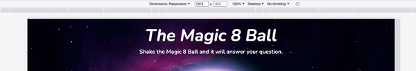
    </details>

* Result
  * The heading responded as expected in all of the above testing.
  * The header is located at the top of the page and the text of both elements, within the header, maintain good contrast with the background image on all devices and screen sizes.
  * On devices with a screen width of 768px or smaller, the font size of the h1 and p elements reduce in size as expected; reducing further at the screen width (screen height for landscape orientation) break points of 480px and 339px. 

&nbsp;

### 8 Ball

  * Expected
    * The 8 Ball should be located centrally below the header and consist of an outer black circle and an inner white circle. The holding text should be a black number "8". 
    * A glow effect should be visible around the outer edge of the black circle which blends well with the background image.
    * On devices with a screen width of 768px or smaller, the 8 ball, and text within, should reduce in size; reducing further at the screen width (screen height for landscape orientation) break points of 480px and 339px. 

  * Testing
    * The 8 Ball was tested on a laptop with a screen width of greater than 768px in order to verify that the size and contrast with the background image was sufficient. 
    * Chrome DevTools was used to simulate mobile devices and to check for reactiveness.
    * The 8 Ball was checked in both portrait and landscape orientations on mobile devices to ensure that it continued to function sufficiently well.
      <details><summary>8 Ball Testing</summary>
        
      </details>

  * Result
    * The 8 Ball responded as expected in all of the above testing.
    * All content was horizontally aligned to the centre of the page and reactive to various devices and screen sizes.
    * A glow effect is visible around the outer edge of the black circle and blends well with the background image.
    * The 8 Ball functions well on mobile devices in both portrait and landscape orientation.

&nbsp;

### 8 Ball Animation

  * Expected
    * When a user submits a valid question, using either the enter key or "Shake!" button, a 1 second animation should shake the 8 Ball from side-to-side.
    * When the animation has ended, an answer should be displayed, at the centre of the 8 ball, for 2 seconds.
    * The 8 Ball should then return to its default state.  

  * Testing
    * A valid question was submitted to trigger the 8 ball.
    * The 8 Ball animation was checked in both portrait and landscape orientations on mobile devices to ensure that it continued to function sufficiently well.
      <details><summary>8 Ball Animation Testing</summary>
        
      </details>

  * Result
    * When a valid question was submitted, the 8 Ball animation began as expected, lasting 1 second.
    * After the animation, an answer was displayed, at the centre of the 8 Ball, for 2 seconds.
    * The 8 Ball then returned to its default state.
    * The 8 Ball animation functions well on mobile devices in both portrait and landscape orientation.

&nbsp;

### User Input

  * Expected
    * The user input should consist of a text input and a button element.
    * Placeholder text should be displayed, within the text input, prompting the user to submit a question.
    * The "Shake!" button should provide feedback when the user hovers over it or clicks on it, when used on a desktop device..
    * It should be possible to submit a valid question by either an 'enter' key press or by clicking on the "Shake!" button.
    * Once a valid question has been submitted, it should not be possible to submit a subsequent question until after the 8 Ball animation, and displaying of the answer text, has ended.
    * When the 8 Ball animation and displaying of the answer text have ended, the text input field should be cleared of the previous question.

  * Testing
    * A valid question was submitted using first the 'enter' key and subsequently by clicking on the "Shake!" button.
    * Attempts to resubmit a question were made while the 8 Ball animation was running and also when the answer was being displayed.
    * The "Shake!" button was checked for feedback upon hover over and click events, when used on a desktop device.
      <details><summary>User Input Testing</summary>
        
      </details>

  * Result
    * Placeholder text is displayed, within the text input, prompting the user to submit a question.
    * The "Shake!" button provides feedback when the user hovers over it or clicks on it, when used on a desktop device..
    * A valid question can be submitted by either an 'enter' key press or by clicking on the "Shake!" button. 
    * When a valid question is submitted, it is not possible to submit a subsequent question until after the 8 Ball animation, and displaying of the answer text, has ended.
    * When the 8 Ball animation and displaying of the answer text ends, the text input field is cleared of the previous question.
        
&nbsp;

### Error Message

  * Expected
    * When the user attempts to submit a question, without typing anything into the text input field, an error message should appear below the "Shake!" button, prompting them to ask a question.
    * The error message should disappear after 1.5 seconds.

  * Testing
    * Multiple attempts were made to submit an empty text input field using both the 'enter' key and by clicking on the "Shake!" button.
    * Testing was carried out across various devices and screen widths to ensure that the error message appeared as expected and that the text remained horizontally aligned to the centre of the page while maintaining good contrast with the background image.
      <details><summary>Error Message Testing</summary>
        
      </details>

  * Result
    * When a user attempts to submit a question, without typing anything into the text input field, an error message appears below the "Shake!" button, prompting them to ask a question.
    * The error message disappears after 1.5 seconds.
    * The error message appears as expected, on all devices and screen sizes, and the text remains horizontally aligned to the centre of the page while maintaining good contrast with the background image.

&nbsp;

### Footer

  * Expected
    * The footer should be located at the bottom of the page and contain copyright text, aligned centrally.
    * The footer text should have good contrast with the background image.

  * Testing
    * The footer was tested for responsiveness on various screen sizes and devices using Chrome DevTools.
    * It was verified that the footer text maintained good contrast with the background image.
    * Testing was carried out across various devices and screen widths to ensure that the footer text remained horizontally aligned to the centre of the page.
      <details><summary>Footer Testing</summary>
        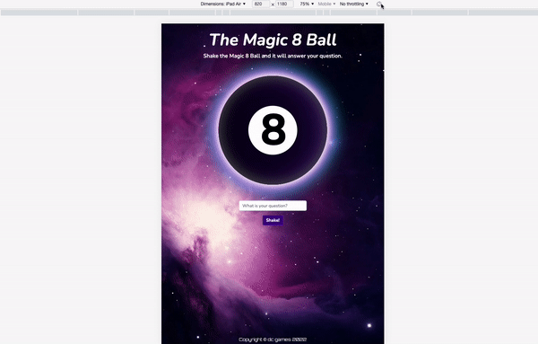
      </details>

  * Result
    * The footer is located at the bottom of the page and contains the copyright text.
    * The footer text has good contrast and is horizontally aligned to the centre of the page on all devices and screen sizes.

&nbsp;

[Back to top &uarr;](#testing)

## Lighthouse
[Lighthouse](https://developer.chrome.com/docs/lighthouse/overview/) was used to audit performance, accessibility, best practices and SEO across the website.

  * [Lighthouse Report: Desktop](readme-files/lighthouse/lighthouse-desktop.pdf)
  * [Lighthouse Report: Mobile](readme-files/lighthouse/lighthouse-mobile.pdf)

&nbsp;

[Back to top &uarr;](#testing)

## Browser Compatibility

[LambdaTest](https://www.lambdatest.com/) was used to test the site across a number of browsers, including:

### Chrome: Windows
  <details><summary>The Magic 8 Ball on Chrome.</summary>
  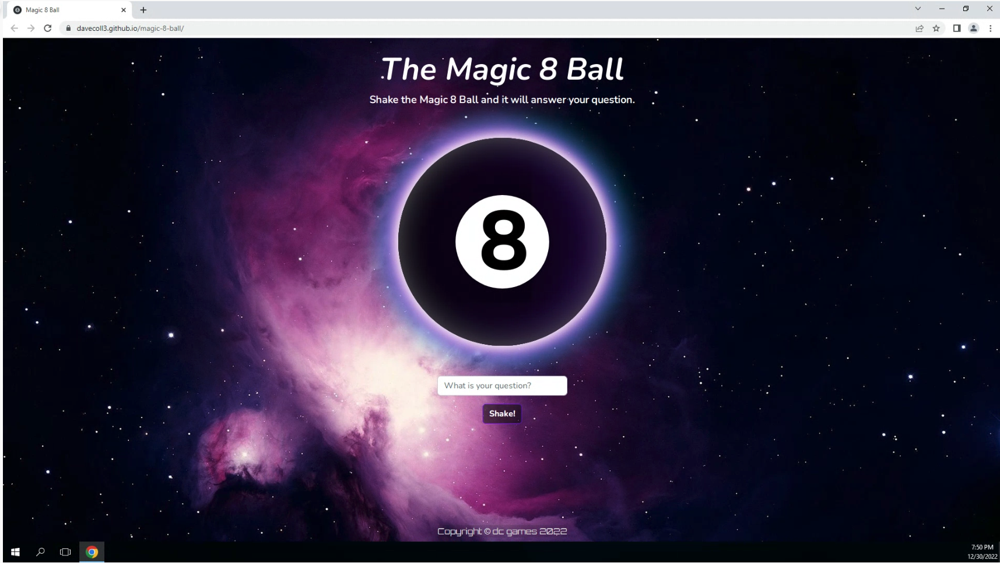
  </details>
  
  &nbsp;

  ### Chrome: Android
  <details><summary>The Magic 8 Ball on Chrome (Android).</summary>
  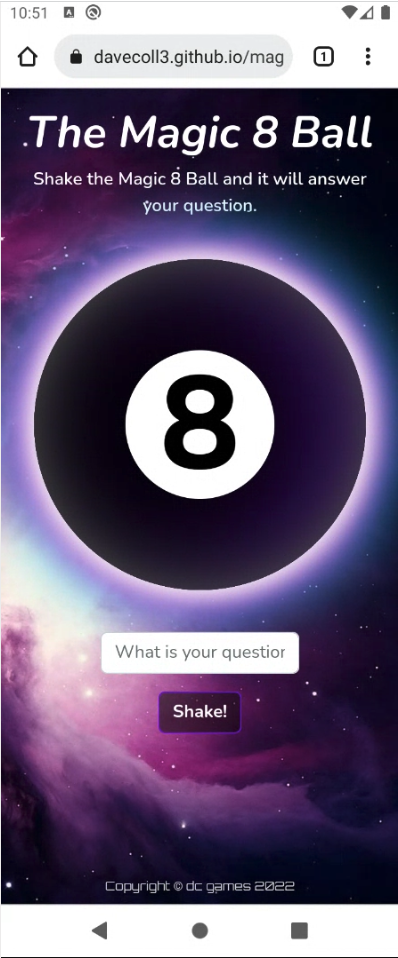
  </details>

  &nbsp;

  ### Safari: MacOS
  <details><summary>The Magic 8 Ball on Safari.</summary>
  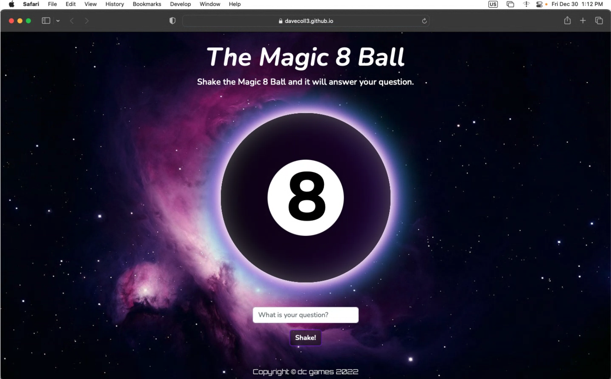
  </details>

  &nbsp;

  ### Safari: iOS
  <details><summary>The Magic 8 Ball on Safari (iOS).</summary>
  
  </details>

  &nbsp;

  ### MS Edge: Windows
  <details><summary>The Magic 8 Ball on MS Edge.</summary>
  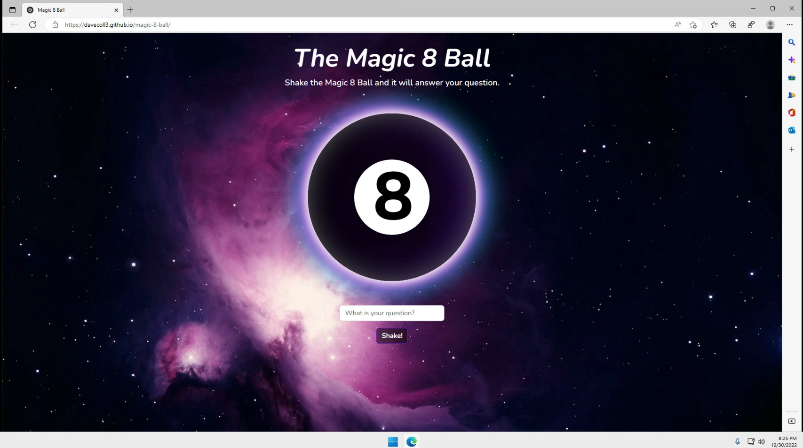
  </details>

  &nbsp;

  ### Firefox: Windows
  <details><summary>The Magic 8 Ball on Firefox.</summary>
  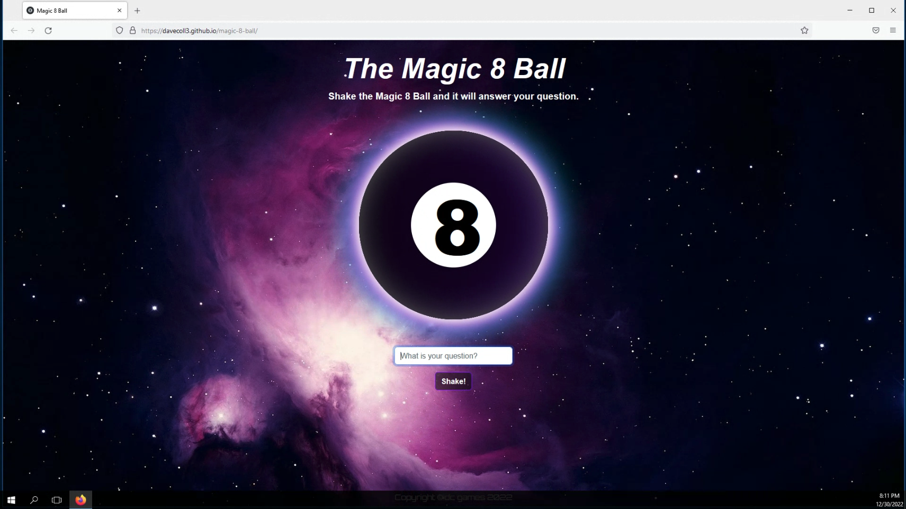
  </details>

  &nbsp;

  ### Opera: Windows
  <details><summary>The Magic 8 Ball on Opera.</summary>
  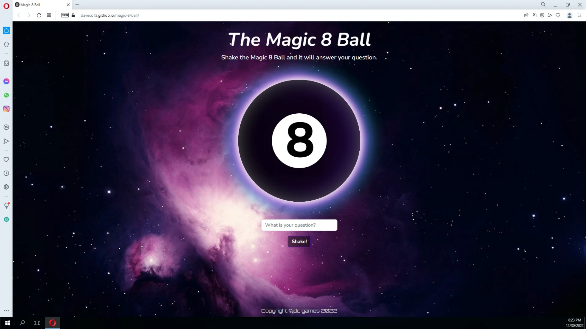
  </details>

  &nbsp;

  ### Brave: Windows
  <details><summary>The Magic 8 Ball on Brave.</summary>
  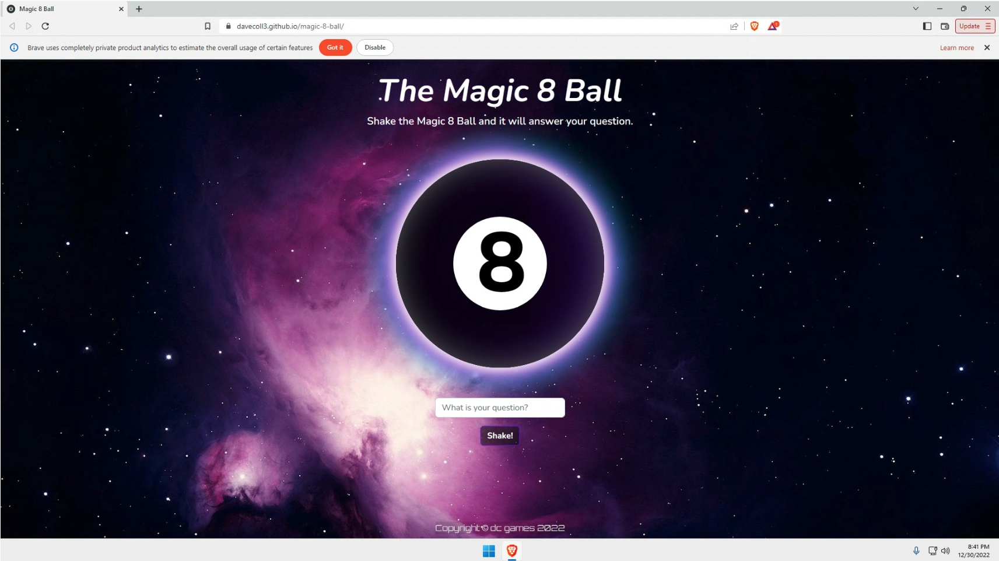
  </details>


&nbsp;

[Back to top &uarr;](#testing)

## Bugs

### Scrolling
  During testing, it was noted that when on a mobile device, in landscape orientation, while there was content below the fold, it was not possible to scroll down to view it and it was only accessible with the use of the tab key. It was eventually discovered that an overflow: hidden (as below) property had been added to the body element which was causing this issue. Removing the overflow property resolved the issue.
  
  ```
  body {
    font-family: 'Nunito', sans-serif;
    height: 100%;
    display: flex;
    flex-direction: column;
    align-items: center;
    text-align: center;
    overflow: hidden;
    color: #fff;
  }

  ```

  <details><summary>Scrolling Bug Screenshot (the visible scroll was achieved with use of the tab key)</summary>
  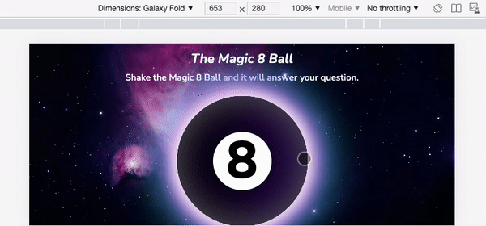
  </details>

  &nbsp;

### Background Image
  During testing, it was noted that when on a mobile device, in landscape orientation, the background image was not covering the entirety of the background. After some trial and error, it was found that by removing the 'no-repeat' property from the below CSS code resolved this issue.
  
  ```
body {
  background: url("../images/8-ball-background.webp") no-repeat bottom center;
}
  ```

  <details><summary>Background Image Bug Screenshot</summary>
  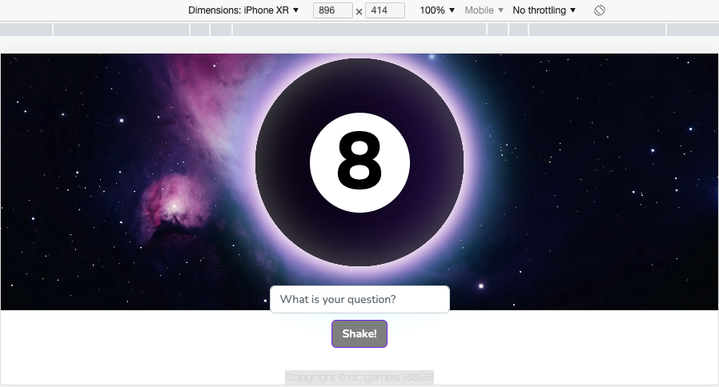
  </details>

  &nbsp;

### Footer
  The placement of the footer element was initially controlled by the addition of the Bootstrap utility class of 'fixed-bottom' which worked well. However, during testing, it was discovered that when on a mobile device, in landscape mode, the footer was blocking content and would be better positioned if it were flushed to the bottom of the page. Having tried several different methods to obtain the desired positioning, it was finally achieved using flexbox which was already being implemented on the site. Namely, flex-grow: 1 was added to the main element and flex-grow: 0 to the footer element (as below). 

  ```
  body {
    height: 100%;
    display: flex;
    flex-direction: column;
    align-items: center;
    text-align: center;
    color: #fff;
    }

  .page-content {
    min-height: 100%;
    display: flex;
    flex-direction: column;
    align-items: center;
  }

  main {
    flex-grow: 1;
  }

  .copyright {
    flex-shrink: 0;
    text-align: center;
    margin: 8px;
    color: #DCDCDC;
  }
  ```

  <details><summary>Footer Bug Screenshot</summary>
  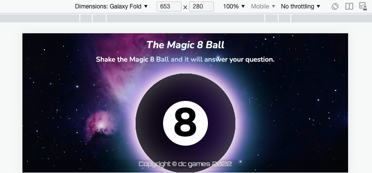
  </details>

&nbsp;

  ### 'Shake!' Button
  When testing the game element it was discovered that, when a question was submitted by the user, it was possible to resubmit subsequent questions before the 8 Ball had completed its animation and displaying of the answer. This was due to the 'Shake!' button being continually active and was resolved by altering the JavaScript by adding "button.disabled = true;" to the validateQuestion function (as below). 

  ```
  function validateQuestion() {
    if (question.value == "") {
      errorMessage.classList.remove('error-message-display');
      setTimeout(errorTimeOut, 1500);
      return false;
    } else {
      ballBlack.classList.add('animate');
      button.disabled = true;
      setTimeout(animationTimeOut, 1000);
    }
  }
  ```
  
  Additionally, 'question.value = '';' was added to the answerTimeOut function to clear the text input field and prevent the user from instantly submitting the same question a second time.

  ```
  function answerTimeOut() {
    answer.textContent = '8';
    answer.classList.remove('answer-text');
    answer.classList.add('holding-text');
    question.value = '';
    button.disabled = false;
  }
  ```

  <details><summary>'Shake!' Button Bug Screenshot</summary>
  
  </details>

  &nbsp;

[Back to top &uarr;](#testing)

[Back to README.md doc](README.md)